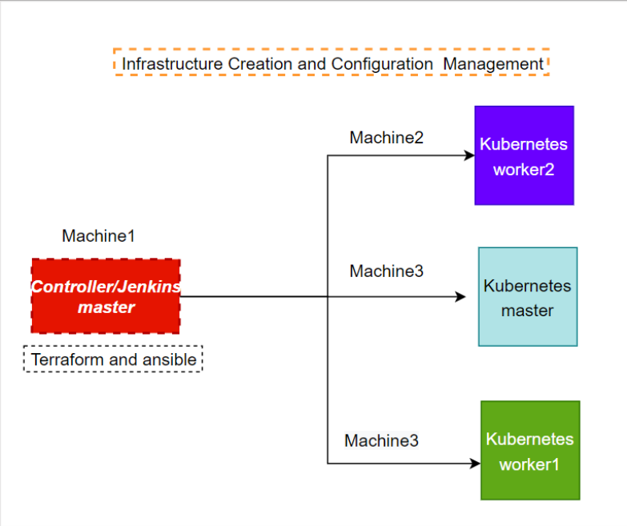
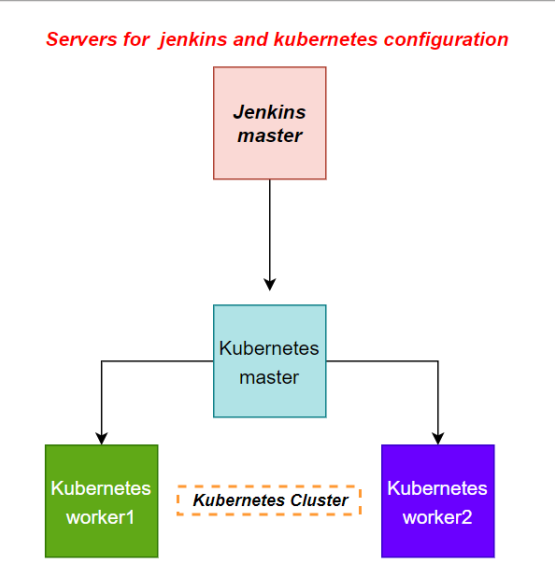

````
# End-to-End DevOps Lifecycle Implementation Using Jenkins, Docker, Kubernetes, Ansible, and Terraform for a Monolithic Product Deployment

## 🚀 Project Overview

This project demonstrates a complete DevOps lifecycle solution for **Analytics Pvt Ltd**, a product-based organization experiencing rapid user growth. The project involves implementing a scalable, automated deployment pipeline using industry-standard tools such as **Jenkins**, **Docker**, **Kubernetes**, **Ansible**, and **Terraform**, while retaining the Docker containers used in testing.

The monolithic application (source: [hshar/website](https://github.com/hshar/website.git)) is built, containerized, and deployed across a Kubernetes cluster in AWS using an IaC-first and automation-centric approach.

---

## 🎯 Objectives

- ✅ Implement Git workflow with version control
- ✅ Trigger code build upon commits to the master branch
- ✅ Automate Docker image creation and push to DockerHub
- ✅ Deploy the application to a Kubernetes cluster with 2 replicas
- ✅ Expose application via NodePort (30008)
- ✅ Automate software installations using Ansible
- ✅ Provision infrastructure in AWS using Terraform

---

## 🛠️ Tools & Technologies

| Domain                  | Tool/Technology                |
|-------------------------|-------------------------------|
| Version Control         | Git, GitHub                   |
| CI/CD                   | Jenkins                       |
| Containerization        | Docker                        |
| Orchestration           | Kubernetes                    |
| Configuration Management| Ansible                       |
| Infrastructure as Code  | Terraform                     |
| Cloud Provider          | AWS                           |

---

## 🗂️ Project Structure

```bash
project-root/
│
├── Docker-installation/   # Docker installation script
├── etc-ansible/           # Ansible Playbooks for software provisioning { install k8s via ansible playbook }
├── in-Github/             # Github repo and files , contains k8s ( Deployment and service YAMLs ) & Doclerfile
├── kubernetes/            # Deployment and service YAMLs inside the Github folder
├── Dockerfile             # Docker image definition inside the Github folder
├── Output-images/         # contains the project output and arch
├── terrafolder/           # contain main.tf file, to launch 3 t2.medium instances
├── ansible/               # script to install ansible
├── aws-cli-installation/  # install aws cli to connect terraform with AWS
├── jenkins-pipiline       # pipeline written in jekins pipeline that launch website while commit happens in github
├── Capstone2              # Project steps output
├── Steps                  # Project explained step-by-step
└── README.md              # Project documentation
````

---

## ⚙️ System Architecture

### Machines & Roles

| Machine | Installed Software       |
| ------- | ------------------------ |
| Worker1 | Jenkins, Java            |
| Worker2 | Docker, Kubernetes       |
| Worker3 | Java, Docker, Kubernetes |
| Worker4 | Docker, Kubernetes       |

---

## 📦 DevOps Lifecycle Breakdown

### 1. Git Workflow

* Monolithic app version-controlled via GitHub.
* Release occurs on the **25th of every month**.

### 2. CI Pipeline with Jenkins

* Triggered by `push` events on `master` branch.
* Builds the Docker image using `Dockerfile`.
* Pushes image to DockerHub with version tagging.

### 3. Docker & Kubernetes

* Docker container is deployed to a Kubernetes cluster.
* Uses **2 replicas** and exposed via **NodePort 30008**.

### 4. Infrastructure Provisioning (Terraform)

* EC2 Instances for workers and Jenkins master.
* Security groups and networking configured via IaC.

### 5. Configuration Management (Ansible)

* Automates software installation across workers.
* Ensures consistent environment setup.

---

## 🧪 Testing & Validation

* Verified Jenkins pipeline execution on `git push`.
* Ensured Docker image is built and pushed correctly.
* Kubernetes cluster pulls image and runs 2 replicas.
* NodePort service successfully exposes the app at `http://<NodeIP>:30008`.

---

## 🖼️ Architecture Diagrams & Screenshots

### 📌 Architecture Diagram



### 📌 Jenkins Pipeline Execution



---

## 📚 References

* [Docker Docs](https://docs.docker.com/)
* [Kubernetes Docs](https://kubernetes.io/docs/)
* [Terraform Docs](https://developer.hashicorp.com/terraform/docs)
* [Ansible Docs](https://docs.ansible.com/)
* [Jenkins Pipeline](https://www.jenkins.io/doc/book/pipeline/)

---

## 👨‍💻 Author

**Venkatesh**
AWS | DevOps | ECE
[GitHub](https://github.com/venkatesh1715)

